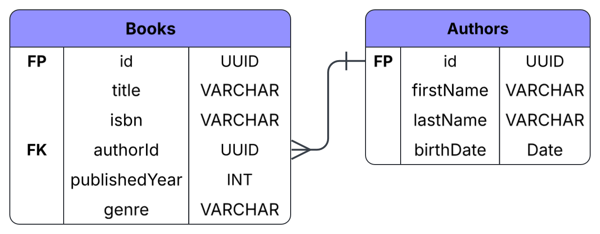

# 1. Functional and Non-Functional Requirements

## Functional Requirements
| Requirement ID | Description                                                                                    |
|----------------|------------------------------------------------------------------------------------------------|
| FR-1           | Users must be able to add, view, update, and delete information about authors.                 |
| FR-2           | Users must be able to add, view, update, and delete books.                                     |
| FR-3           | The system must support searching and filtering books by author, publication year, and genre.  |
| FR-4           | The system must support pagination for lists of books and authors.                             |

## Non-Functional Requirements
| NFR Category    | Requirement                                                         | Metric / Target                                                                                           |
|-----------------|---------------------------------------------------------------------|-----------------------------------------------------------------------------------------------------------|
| Performance     | The system must respond quickly to user requests.                   | Most GET requests should be completed within 500 ms under normal load.                                    |
| Security        | Protected API endpoints must require JWT authentication.            | Requests with an invalid or missing JWT must return HTTP 401. Access token lifetime: 15 minutes.          |
| Availability    | The system should remain available and stable during normal use.    | Uptime target: at least 99% per month.                                                                    |
| Scalability     | The API should be stateless to support future horizontal scaling.   | The application should support at least 100 concurrent users without significant performance degradation. |
| Caching         | Frequently requested data should be cached to reduce database load. | Cached resources should be served from the cache when available.                                          |
| Maintainability | The code and API should be easy to maintain and extend.             | Unit test coverage: at least 70%; all public API endpoints documented in Swagger/OpenAPI.                 |

# 2. Entities
The system uses two main entities: **Author** and **Book**.



# 3. REST API Design and HTTP Status Codes

## Authors (`/api/v1/authors`)
| Method | Endpoint        | Description                       | Success                                                                                             | Error              |
|--------|-----------------|-----------------------------------|-----------------------------------------------------------------------------------------------------|--------------------|
| GET    | `/authors`      | Get a list of authors.            | `200 OK`                                                                                            | —                  |
| POST   | `/authors`      | Create a new author.              | `201 Created`<br>*(the `Location` header returns the URI of the new resource, e.g. `/authors/123`)* | `400 Bad Request`  |
| GET    | `/authors/{id}` | Get details of a specific author. | `200 OK`                                                                                            | `404 Not Found`    |
| PUT    | `/authors/{id}` | Fully update an author's data.    | `200 OK`                                                                                            | `404 Not Found`    |
| DELETE | `/authors/{id}` | Delete an author.                 | `204 No Content`                                                                                    | —                  |

##  Books (`/api/v1/books`)
| Method | Endpoint      | Description                                           | Success          | Error              |
|--------|---------------|-------------------------------------------------------|------------------|--------------------|
| GET    | `/books`      | Get a list of books.                                  | `200 OK`         | —                  |
| POST   | `/books`      | Add a new book.                                       | `201 Created`    | `400 Bad Request`  |
| GET    | `/books/{id}` | Get book details.                                     | `200 OK`         | `404 Not Found`    |
| PATCH  | `/books/{id}` | Partially update a book (e.g. change only the genre). | `200 OK`         | —                  |
| DELETE | `/books/{id}` | Delete a book.                                        | `204 No Content` | —                  |

## Pagination
Resource collection endpoints (`GET /authors`, `GET /books`) support pagination via query parameters.

**Query Parameters:**

| Parameter | Type    | Required | Default                       | Description              |
|-----------|---------|----------|-------------------------------|--------------------------|
| `page`    | integer | no       | `1`                           | Page number              |
| `limit`   | integer | no       | `20` (authors) / `10` (books) | Number of items per page |

**Example request:**

```
GET /api/v1/books?page=2&limit=10&genre=Fiction
```

**Response format:**

The response includes pagination metadata alongside the data, wrapped in an envelope object:

```json
{
  "content": [ /* array of resources */ ],
  "page": {
    "number": 2,
    "size": 10,
    "totalElements": 57,
    "totalPages": 6
  },
  ...
}
```

**Сonstraints:**

| Rule                                   | Behavior                                       |
|----------------------------------------|------------------------------------------------|
| `limit` exceeds the maximum (e.g. 100) | Clamped to the maximum allowed value           |
| `page` is less than 1 or not a number  | `400 Bad Request`                              |
| Requested page is out of range         | Returns `200 OK` with an empty `content` array |

## HATEOAS
> According to Level 3 of the Richardson Maturity Model, the API returns hypermedia links for navigation.

### Single resource response

`GET /api/v1/authors/123`

```json
{
  "id": 123,
  "firstName": "Stephen",
  "lastName": "King",
  "_links": {
    "self":   { "href": "/api/v1/authors/123" },
    "books":  { "href": "/api/v1/authors/123/books" },
    "update": { "href": "/api/v1/authors/123", "method": "PUT" },
    "delete": { "href": "/api/v1/authors/123", "method": "DELETE" }
  }
}
```

`GET /api/v1/books/45`

```json
{
  "id": 45,
  "title": "It",
  "genre": "Horror",
  "publicationYear": 1986,
  "authorId": 123,
  "_links": {
    "self":   { "href": "/api/v1/books/45" },
    "author": { "href": "/api/v1/authors/123" },
    "update": { "href": "/api/v1/books/45", "method": "PATCH" },
    "delete": { "href": "/api/v1/books/45", "method": "DELETE" }
  }
}
```

### Collection response
`GET /api/v1/books?page=2&limit=10&genre=Fiction`

```json
{
  "content": [
    {
      "id": 45,
      "title": "It",
      "genre": "Horror",
      "_links": {
        "self": { "href": "/api/v1/books/45" }
      }
    }
  ],
  "page": {
    "number": 2,
    "size": 10,
    "totalElements": 57,
    "totalPages": 6
  },
  "_links": {
    "self":  { "href": "/api/v1/books?page=2&limit=10" },
    "first": { "href": "/api/v1/books?page=1&limit=10" },
    "prev":  { "href": "/api/v1/books?page=1&limit=10" },
    "next":  { "href": "/api/v1/books?page=3&limit=10" },
    "last":  { "href": "/api/v1/books?page=6&limit=10" }
  }
}
```
### Rules
| Rule                             | Description                                                                                                             |
| -------------------------------- | ----------------------------------------------------------------------------------------------------------------------- |
| Every resource has a `self` link | Shows the URL of the current resource.                                                                                  |
| Links show available actions     | Only available actions are included, such as `delete` if deletion is allowed.                                           |
| Related resources use links      | For example, a book links to its author instead of including all author data.                                           |
| Lists include pagination links   | Collections include `self`, `first`, `prev`, `next`, and `last` links when applicable.                                  |
| Links use clear names            | Standard names such as `self`, `next`, and `prev` are used, as well as domain-specific names like `author` and `books`. |

## Authentication
The API uses JWT authentication.
For protected endpoints, the client must send the token in the `Authorization` header:
```text
Authorization: Bearer <JWT-token>
```

**JWT structure**
 
A JWT consists of three parts, separated by dots (`header.payload.signature`):
 
**Header:**
 
```json
{
  "alg": "HS256",
  "typ": "JWT"
}
```
 
**Payload:**
 
```json
{
  "sub": "123",
  "role": "USER",
  "exp": 1753456789
}
```
 
**Signature** - generated from the header, payload, and a secret key, ensuring the token hasn't been tampered with.
 
Public endpoints do not require authentication.

## Error Format
All API errors return the same JSON structure:

```json
{
  "error": "Bad Request",
  "message": "The 'isbn' field is required.",
  "status": 400,
  "timestamp": "2026-07-25T16:23:12Z"
}
```
Common HTTP status codes:
* **400 Bad Request** – Invalid request data.
* **401 Unauthorized** – Missing, invalid, or expired JWT.
* **403 Forbidden** – The user does not have permission to perform the action.
* **404 Not Found** – The requested resource was not found.
* **500 Internal Server Error** – An unexpected server error occurred.

## Caching
The API uses standard HTTP caching headers, such as `Cache-Control` and `ETag`.

### Cached Resources
| Endpoint            | Cache-Control          | Reason                                            |
| ------------------- | ---------------------- | ------------------------------------------------- |
| `GET /authors/{id}` | `public, max-age=3600` | Author information usually does not change often. |
| `GET /books/{id}`   | `public, max-age=3600` | Book information usually does not change often.   |

Responses also include an `ETag` header that identifies the current version of the resource:

```text
Cache-Control: public, max-age=3600
ETag: "a1b2c3d4"
```

When a client requests the same resource again, it can send the ETag using the `If-None-Match` header. If the resource has not changed, the server returns `304 Not Modified` instead of sending the full data again.

### Resources That Are Not Cached

* **POST, PUT, PATCH, DELETE** requests are not cached because they change data.
* **GET /books** and **GET /authors** collection requests use short caching (`max-age=60`) or are not cached. This prevents users from receiving outdated lists when new books or authors are added.

### Cache Invalidation
When a book or author is updated or deleted, its data changes. As a result, the ETag changes, and the next request returns the updated version of the resource.
